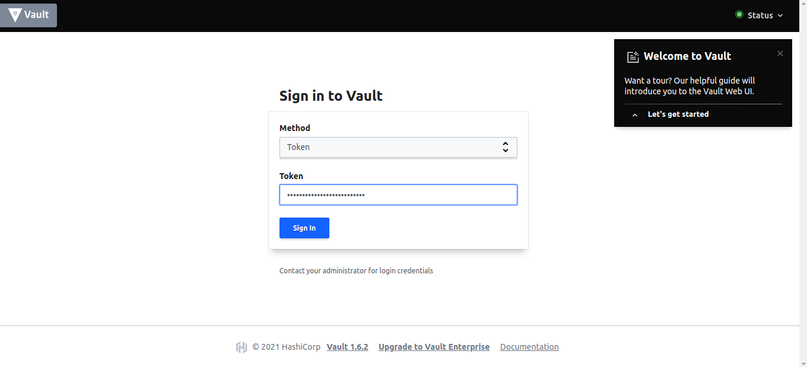

# Vault

## 🌱 Projeto

- Playbook para subir uma ferramenta para armazenar e controlar acesso a tokens, senhas, certificados, chaves de criptografia para proteger segredos e outros dados confidenciais usando uma IU, CLI ou API HTTP.

## Tecnologias

- Ansible
- Docker
- Vagrant
- Virtual Box
- Python 3

## Ambiente

- Subindo a VM: Navegue até o diretório `vagrant` e utilize o comando abaixo:

```bash
$ vagrant up
```

- Acessando a VM

```bash
$ vagrant ssh
```

- Acesse a vm, mude para usuário root e atribua uma senha a ele
```bash
$ sudo su
# passwd root
```

## Public Key

- Gera uma chave pública para trabalhar com o `ansible`

```bash
$ ssh-keygen
```

- Saída
```bash
Generating public/private rsa key pair.
Enter file in which to save the key (/home/leonardo/.ssh/id_rsa): 
```

- Entre com um novo local para chave ou deixe o padrão, no meu caso deu o nome de ansible para a chave:
```bash
/home/leonardo/.ssh/ansible
```

- Crie um arquivo ansible.pub com a chave criada em `roles/configure-host/files`

- Copie sua chave pública para a vm criada
```bash
$ ssh-copy-id root@192.168.10.2
```

- Caso queira copiar uma chave em específico
```bash
$ ssh-copy-id -i ~/.ssh/ansible root@192.168.10.2
```

- Ele irá pedir a senha, entra com a senha que você atribuiu ao root em um dos passos acima


## Playbook Site

> Tags 

- `setup` - Realiza configurações no host instalando alguns softwares que são pré-requisitos, configurar usuário e copiar a chave pública para a vm;
- `vault` - Sobe o serviço Vault;

> Linha de comando

```bash
$ ansible-playbook -i inventories/virtualbox.yml site.yml --tags setup
$ ansible-playbook -i inventories/virtualbox.yml site.yml --tags vault 
```

ou

```bash
$ ansible-playbook -i inventories/virtualbox.yml site.yml --tags setup,vault
``` 

## Inicializando o Vault

- Acessando o Container

```bash
$ docker exec -it vault bash
```

- Iniciando o Vault
```bash
$ vault operator init
```

- Saída
```bash
Unseal Key 1: ZEhODqNudyndwOYasW/TOj9XXcN5lwQCUvSmHg4NtB2I
Unseal Key 2: aCa75TbVX2eaRTpLYH6sh4R+LgS2WApttgbSqoaGX+jk
Unseal Key 3: twsRerHt+LxICDO1at80CNMs8XOSyXqdfu/9HvQOlH7O
Unseal Key 4: OVOHyw+z+jOOLIiJaLe/o1A7qh60tPO9m9br3b/42D5w
Unseal Key 5: +pSfIWRv6yJiKbDIEeu3i4/YFP0KIF61WYWBTVV6Z4hz

"Initial Root Token": s.9eUwoazl1jjieDHJpSM2ErR4

Vault initialized with 5 key shares and a key threshold of 3. Please securely
distribute the key shares printed above. When the Vault is re-sealed,
restarted, or stopped, you must supply at least 3 of these keys to unseal it
before it can start servicing requests.

Vault does not store the generated master key. Without at least 3 key to
reconstruct the master key, Vault will remain permanently sealed!

It is possible to generate new unseal keys, provided you have a quorum of
existing unseal keys shares. See "vault operator rekey" for more information.
```

- Desbloqueio do Vault - Utilize 3 das 5 chaves acima:

```bash
$ vault operator unseal ZEhODqNudyndwOYasW/TOj9XXcN5lwQCUvSmHg4NtB2I
$ vault operator unseal aCa75TbVX2eaRTpLYH6sh4R+LgS2WApttgbSqoaGX+jk
$ vault operator unseal twsRerHt+LxICDO1at80CNMs8XOSyXqdfu/9HvQOlH7O
```

- Chave `root` utilizada para logar no Vault: Tanto via cli quanto web:
```bash
"Initial Root Token": s.9eUwoazl1jjieDHJpSM2ErR4
```

- Habilitar um dispositivo de auditoria que mantém um registro detalhado de todas as solicitações e respostas ao Vaul
```bash
$ vault audit enable file file_path=/vault/logs/audit.log
```

- Testando, execute o seguinte comando para visualizar todos os dispositivos de auditoria habilitados:
```bash
$ vault audit list
```

>> Acesso WEB

- url: `http://192.168.10.2/ui`



